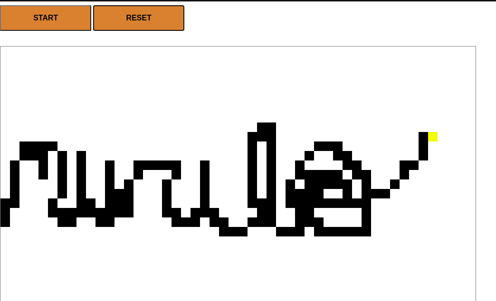

 

# Etch-a-Sketch

In this project I:

- Used HTML, CSS and Javascript to implement an Etch-a-Sketch board.

# What it does

- When the user clicks the "Start" button, a pop up will ask the size of the board;
- In the board, the user can draw something by dragging the mouse;
- The user can reset the board at any time.

## Built with

- HTML, CSS and Javascript.

## Live Demo

[Click here](https://raw.githack.com/MuriloRoque/etch_a_sketch/feature/index.html)

## Author

Murilo Roque Paiva da Silva

Github: [@MuriloRoque](https://github.com/MuriloRoque)

Twitter: [@MuriloRoquePai1](https://twitter.com/MuriloRoquePai1)

Linkedin: [MuriloRoque](https://www.linkedin.com/in/murilo-roque-b1268741/)

## 🤝 Contributing

Contributions, issues and feature requests are welcome! Start by:

- Forking the project
- Cloning the project to your local machine
- `cd` into the project directory
- Run `git checkout -b your-branch-name`
- Make your contributions
- Push your branch up to your forked repository
- Open a Pull Request with a detailed description to the development branch of the original project for a review

## Show your support

Give a ⭐️ if you like this project!
